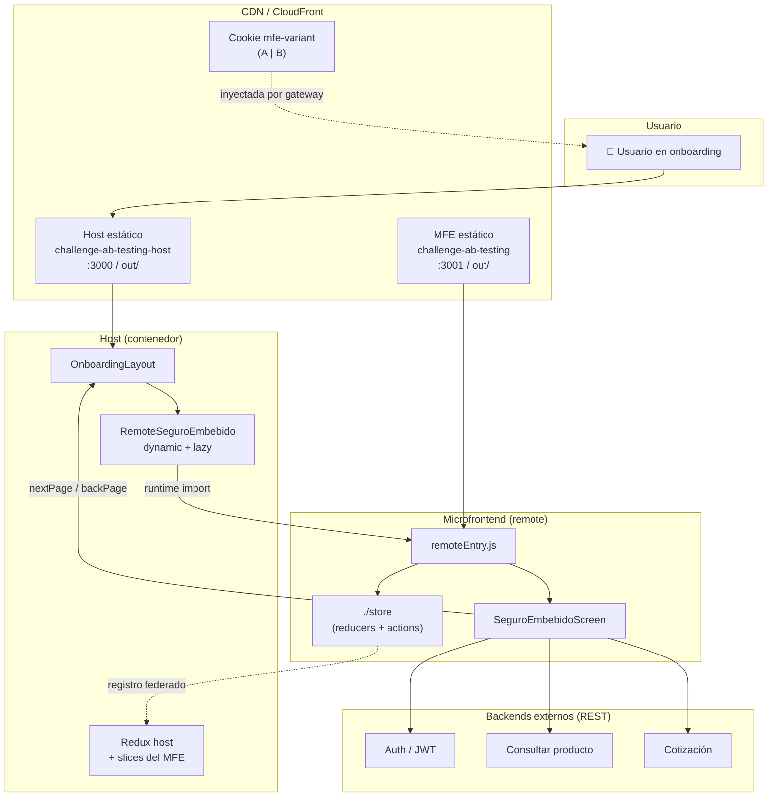
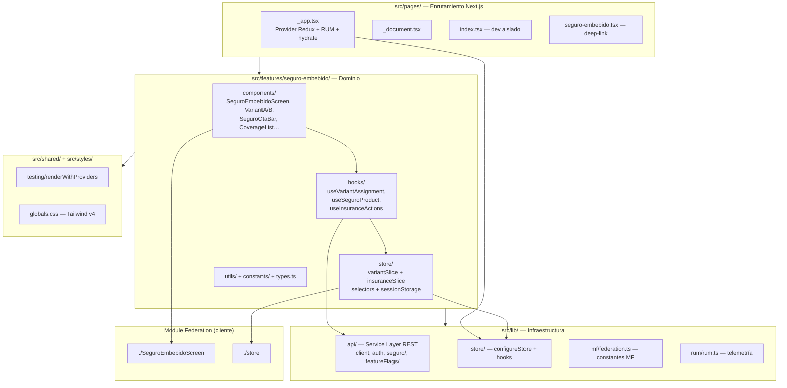
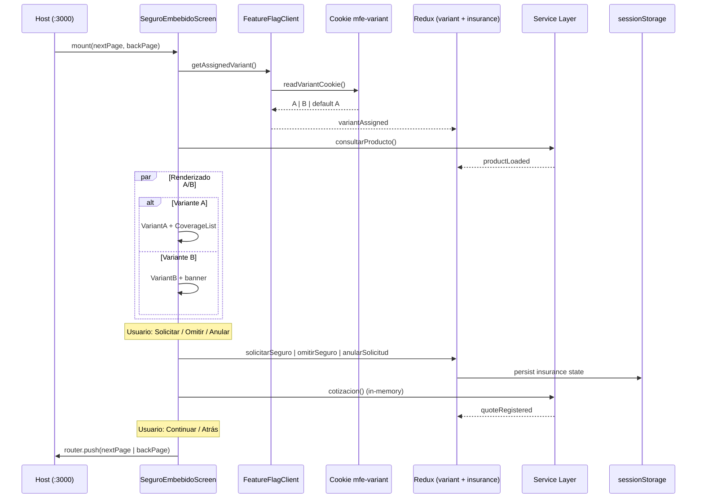
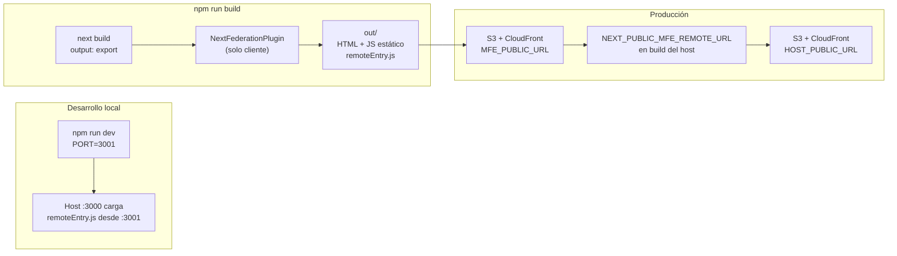
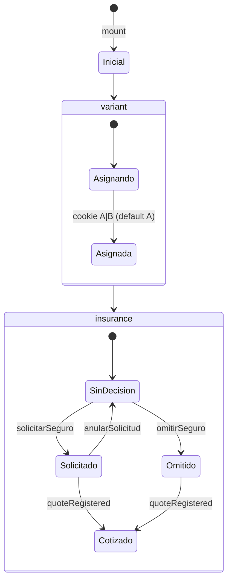

# Arquitectura del microfrontend — Seguro embebido A/B

Documento de referencia de la arquitectura del **remote** `challenge-ab-testing` (`seguroEmbebidoMfe`), integrado en el host `challenge-ab-testing-host`.

**Repositorios:**

| Repositorio | Rol | Puerto dev |
| ----------- | --- | ---------- |
| `challenge-ab-testing` | Remote — expone pantalla de seguro | 3001 |
| `challenge-ab-testing-host` | Host — embebe el MFE en onboarding | 3000 |

**ADRs relacionados** (en `challenge-ab-testing/docs/adr/`):

- [ADR-001](https://github.com/BayteqDev/challenge-ab-testing/blob/main/docs/adr/ADR-001-pages-router-only.md) — SPA estática, Pages Router
- [ADR-003](https://github.com/BayteqDev/challenge-ab-testing/blob/main/docs/adr/ADR-003-redux-state-management.md) — Redux Toolkit
- [ADR-004](https://github.com/BayteqDev/challenge-ab-testing/blob/main/docs/adr/ADR-004-feature-based-architecture.md) — Arquitectura por features
- [ADR-008](https://github.com/BayteqDev/challenge-ab-testing/blob/main/docs/adr/ADR-008-rest-service-layer.md) — Service Layer REST
- [ADR-009](https://github.com/BayteqDev/challenge-ab-testing/blob/main/docs/adr/ADR-009-module-federation-microfrontend.md) — Module Federation

---

## 1. Contexto del sistema

Vista de cómo el MFE se integra con el ecosistema externo.

---

## 2. Arquitectura interna (capas)

Estructura feature-based según ADR-004.

### Reglas de ubicación

| Ubicación | Contenido |
| --------- | --------- |
| `src/pages/` | Solo enrutamiento Next.js; las páginas componen UI desde `features/` |
| `src/features/seguro-embebido/` | Dominio: componentes, hooks, slices Redux, tipos, validaciones |
| `src/shared/` | Código reutilizado por varias features |
| `src/components/` | UI agnóstica de dominio |
| `src/lib/` | Infraestructura: Service Layer REST, store, federation, RUM |
| `src/styles/` | Estilos globales (Tailwind v4) |

---

## 3. Flujo de datos en runtime

Secuencia desde el montaje hasta la decisión del usuario.

---

## 4. Build y despliegue

SPA estática con Module Federation solo en el bundle cliente (ADR-001, ADR-009).

### Flujo de desarrollo local

1. Levantar el MFE: `cd challenge-ab-testing && npm run dev`
2. Levantar el host: `cd challenge-ab-testing-host && npm run dev`
3. Abrir `http://localhost:3000` — el host carga `remoteEntry.js` desde `http://localhost:3001`

---

## 5. Contratos expuestos al host

| Expose | Origen | Propósito |
| ------ | ------ | --------- |
| `./SeguroEmbebidoScreen` | `SeguroEmbebidoScreen.tsx` | UI del piloto A/B embebida en `/onboarding/seguro` |
| `./store` | `features/seguro-embebido/store/index.ts` | Reducers, actions y selectors para Redux compartido |

### Props host → MFE

| Prop | Tipo | Descripción |
| ---- | ---- | ----------- |
| `nextPage` | `string?` | Ruta tras completar el flujo (demo: `/onboarding/despues`) |
| `backPage` | `string?` | Ruta del botón Atrás (demo: `/onboarding/antes`) |

### Salidas MFE → host

| Mecanismo | Contenido |
| --------- | --------- |
| Redux | Slices `variant` e `insurance` |
| Navegación | `router.push(nextPage \| backPage)` cuando aplica |

### Responsabilidades visuales

| Zona | Owner |
| ---- | ----- |
| Encabezado, logo, salir | Host |
| Oferta, variantes A/B, CTAs internos | MFE |
| Loading/error de producto o flags | MFE |

---

## 6. Estado Redux

### Slices

| Slice | Responsabilidad |
| ----- | --------------- |
| `variant` | Variante A/B asignada (`A` \| `B`) |
| `insurance` | Decisión del usuario, producto cargado, cotización |

La decisión de seguro se persiste en `sessionStorage` para sobrevivir recargas de página.

---

## 7. Asignación de variante A/B

| Aspecto | Contrato |
| ------- | -------- |
| Cookie | `mfe-variant` con valor `A` o `B` |
| Escritura | CDN/gateway según administrador de feature flags |
| Lectura | MFE vía `FeatureFlagClient` (sin API directa de flags) |
| Ausente o inválida | Variante A (control) por defecto |

---

## 8. Stack tecnológico

| Aspecto | Decisión |
| ------- | -------- |
| Framework | Next.js 15 Pages Router, React 19, TypeScript |
| Despliegue | SPA estática (`out/`), sin servidor Node en producción |
| Integración | Module Federation (`seguroEmbebidoMfe`) |
| Dominio | Feature `seguro-embebido` con variantes A/B |
| Estado | Redux Toolkit + `sessionStorage` para persistencia |
| APIs | Service Layer en `src/lib/api/` (cliente → REST externo) |
| A/B | Cookie `mfe-variant` (CDN/gateway), default variante A |
| UI | Tailwind v4 + Base UI + Heroicons |
| Tests | Vitest co-located, TDD, cobertura ramas ≥ 80 % |

---

## Referencias

- Contrato host ↔ MFE: `challenge-ab-testing/specs/001-mfe-embedded-insurance/contracts/host-mfe-integration.md`
- Contratos API (mocks): [api-contracts/README.md](./api-contracts/README.md)
- Historia de usuario: [US-29912](../user-stories/US-29912-microfrontend/README.md)
