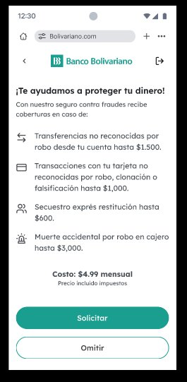
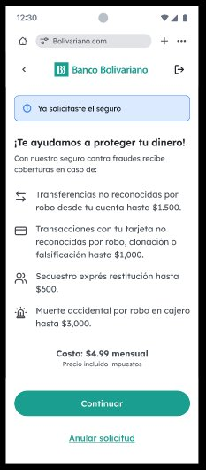
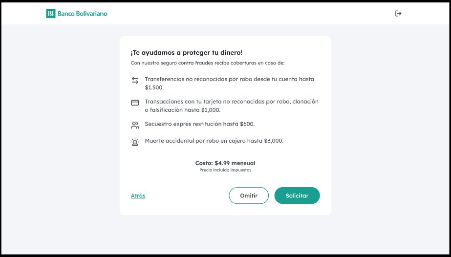
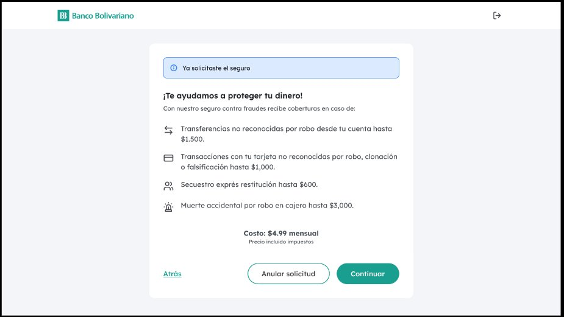
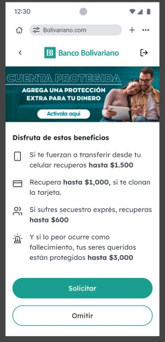
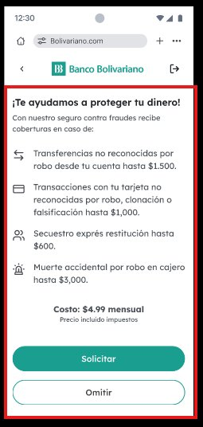

# US-29912: Microfrontend de seguro embebido con experimentación A/B

- Estado: Ready
- Fecha de creación: 2026-06-16
- Última actualización: 2026-06-16 (secuencial alineado con ADO #29912)
- ADO Work Item: [#29912](https://dev.azure.com/BayteqDev/Reto%20BBolivariano/_workitems/edit/29912)

## Descripción

**COMO** cliente de Banco Bolivariano que está contratando una cuenta de ahorro digital online  
**QUIERO** ver una oferta de seguro embebido con variante visual personalizada (control o challenger) durante el onboarding  
**PARA** poder decidir si contratar el seguro contra fraudes de forma informada, y que el banco pueda medir qué variante genera mayor tasa de contratación

## Referencias

- **Requerimiento funcional:** [Requerimiento A/B Testing Seguro Embebido BB](../../requerimiento-ab-testing-seguro-embebido-bb.md)
- **Variante A — Móvil inicial (Solicitar / Omitir):** 
- **Variante A — Móvil solicitado:** 
- **Variante A — Desktop inicial:** 
- **Variante A — Desktop solicitado:** 
- **Variante B — Móvil (challenger):** 
- **Delimitación MFE móvil:** 
- **Delimitación MFE desktop:** 
- **Contratos de API:** [technical-docs/api-contracts/README.md](../../technical-docs/api-contracts/README.md)

## Criterios de aceptación

### Reglas de negocio

- **BR-01** — El microfrontend DEBE renderizar la pantalla de oferta del seguro embebido en las variantes A (control) y B (challenger), tanto en vista móvil como desktop, sin tomar control del encabezado ni del marco general de la aplicación anfitriona (RF-01, RF-04).
- **BR-02** — El sistema DEBE asignar a cada usuario exactamente una variante del experimento (A o B) mediante feature flags, y dicha asignación DEBE permanecer persistente durante toda la sesión de navegación del flujo, incluyendo salidas y reingresos (RF-02, RF-03, CA-02).
- **BR-03** — El microfrontend DEBE mostrar los CTA correctos según el estado de la pantalla: en estado inicial «Solicitar / Omitir» (móvil) y «Atrás / Omitir / Solicitar» (desktop); en estado «solicitado» «Continuar / Anular solicitud» (móvil) y «Atrás / Anular solicitud / Continuar» (desktop) (RF-04, RF-05, CA-03).
- **BR-04** — El porcentaje de asignación entre variantes DEBE poder modificarse desde el administrador de feature flags sin requerir un nuevo despliegue del microfrontend (RF-10, CA-04).
- **BR-05** — El microfrontend DEBE consumir el contrato de API para obtener el producto (seguro) con sus coberturas y costo; la cotización seleccionada DEBE persistir en el store Redux durante la sesión para que la aplicación anfitriona conozca la decisión del cliente (RF-06, RF-07, CA-07).
- **BR-06** — La acción «Solicitar» DEBE registrar la intención de contratación y transicionar la pantalla al estado «solicitado»; la acción «Anular solicitud» DEBE revertir ese estado al estado inicial (RF-08, RF-09).
- **BR-07** — El microfrontend DEBE desplegarse como contenido estático en un bucket S3 servido vía CloudFront, y DEBE superar los análisis de calidad (SonarQube), seguridad y cobertura de pruebas unitarias establecidos por el SDLC del banco (RNF-01 a RNF-06, CA-05, CA-06).

### Escenarios

```gherkin
Escenario: SC-01 - Variante A asignada muestra pantalla control en estado inicial
DADO que el usuario ha sido asignado a la variante A mediante feature flags
CUANDO el usuario llega por primera vez a la pantalla de oferta del seguro dentro del onboarding
ENTONCES ve la pantalla control con el mensaje «¡Te ayudamos a proteger tu dinero!», las coberturas y el costo de $4.99 mensual
Y en móvil ve los botones «Solicitar» y «Omitir»
Y en desktop ve los botones «Atrás», «Omitir» y «Solicitar»

Escenario: SC-02 - Variante B asignada muestra pantalla challenger en estado inicial
DADO que el usuario ha sido asignado a la variante B mediante feature flags
CUANDO el usuario llega por primera vez a la pantalla de oferta del seguro dentro del onboarding
ENTONCES ve el banner «Cuenta protegida — Agrega una protección extra para tu dinero» con CTA «Actívala aquí»
Y ve el título «Disfruta de estos beneficios» con el copy orientado a beneficios en segunda persona
Y ve los mismos CTAs que en variante A según su dispositivo

Escenario: SC-03 - Persistencia de variante al salir y regresar
DADO que el usuario fue asignado a la variante B y visitó la pantalla de seguro
CUANDO el usuario avanza en el onboarding y luego regresa a la pantalla de seguro
ENTONCES sigue viendo la variante B (no cambia a variante A)

Escenario: SC-04 - Transición al estado «solicitado» y reversión
DADO que el usuario está en el estado inicial de la pantalla de seguro
CUANDO el usuario hace clic en «Solicitar»
ENTONCES la pantalla transiciona al estado «solicitado» mostrando «Ya solicitaste el seguro» y los CTA «Continuar / Anular solicitud»
CUANDO el usuario hace clic en «Anular solicitud»
ENTONCES la pantalla regresa al estado inicial con los CTA «Solicitar / Omitir»

Escenario: SC-05 - Modificación de porcentaje de asignación sin redespliegue
DADO que el feature flag de asignación A/B está configurado con 50% A / 50% B
CUANDO un administrador cambia la distribución a 80% A / 20% B en el administrador de feature flags
ENTONCES los nuevos usuarios que ingresen al flujo reciben la variante según el nuevo porcentaje
Y no se requiere un nuevo despliegue del microfrontend para que el cambio tenga efecto
```

## Complejidad sugerida

- **Story points:** 13
- **Justificación:** La historia abarca diseño e implementación del microfrontend completo (dos variantes A/B, dos estados de pantalla, responsivo móvil/desktop), integración con feature flags (asignación, persistencia, control sin redespliegue), consumo de API real con mocks, gestión de estado en Redux, y cumplimiento del SDLC del banco (SonarQube, seguridad, cobertura de pruebas ≥ 80%). El alcance multicomponente con capa de experimentación y requisitos de calidad eleva la estimación a 13 puntos.

## Unidades de trabajo

- `challenge-ab-testing` — microfrontend Next.js estático (Pages Router, Redux, Tailwind v4, Base UI); tarea [TK-29917](./TK-29917-construir-microfrontend-ai-sdlc.md) ([#29917](https://dev.azure.com/BayteqDev/Reto%20BBolivariano/_workitems/edit/29917))
- `challenge-ab-testing-host` — contenedor (host) del onboarding que embebe el MFE; tarea TK-29918 ([#29918](https://dev.azure.com/BayteqDev/Reto%20BBolivariano/_workitems/edit/29918)) en el repositorio `challenge-ab-testing-host`

## Validación

### INVEST

| Letra | Criterio      | Resultado | Notas                                                                                                                                                                                                                   |
| ----- | ------------- | --------- | ----------------------------------------------------------------------------------------------------------------------------------------------------------------------------------------------------------------------- |
| **I** | Independiente | Parcial   | El MFE (`challenge-ab-testing`) y el host (`challenge-ab-testing-host`) son repositorios distintos; TK-29918 depende de TK-29917 para la integración final, pero ambos pueden avanzar en paralelo con mocks. Las tareas de infraestructura (ADO #29913–#29916, #29919) no bloquean el desarrollo funcional. |
| **N** | Negociable    | Cumple    | El alcance (copy, variantes, estados, CTAs) está delimitado en el requerimiento pero admite ajuste del porcentaje A/B y del copy sin cambio de código. Las decisiones de UI pueden refinarse con el PO.                 |
| **V** | Valiosa       | Cumple    | Habilita la experimentación A/B sobre la tasa de contratación del seguro embebido; genera datos de negocio accionables para Banco Bolivariano.                                                                          |
| **E** | Estimable     | Cumple    | Requerimiento funcional completo (RF-01 a RF-10), criterios de aceptación (CA-01 a CA-07), diseños de referencia y contratos de API disponibles.                                                                        |
| **S** | Pequeña       | Parcial   | 13 puntos es el máximo aconsejable. Se recomienda dividir en iteraciones (Sprint 1: estructura MFE + variantes; Sprint 2: feature flags + SDLC) si el equipo así lo decide.                                             |
| **T** | Testeable     | Cumple    | Todos los criterios tienen escenarios Gherkin verificables y BRs con condiciones observables (CTA, estados, persistencia, cobertura).                                                                                   |

### Definition of Ready (DoR)

| Criterio DoR                       | Estado  | Notas                                                                                                                                                                 |
| ---------------------------------- | ------- | --------------------------------------------------------------------------------------------------------------------------------------------------------------------- |
| Dependencias listas                | Cumple  | Diseños Figma disponibles como imágenes en `docs/assets/requerimiento/`. Contratos de API y mocks en `docs/specs/technical-docs/api-contracts/`.                      |
| Inputs/outputs claros              | Cumple  | RF-01 a RF-10 y CA-01 a CA-07 definen entradas (feature flags, API de producto) y salidas (estado Redux de cotización, variante asignada).                            |
| Unidades de trabajo definidas      | Cumple  | Dos repositorios: `challenge-ab-testing` (TK-29917, #29917) y `challenge-ab-testing-host` (TK-29918, #29918); ambas asignadas a Juan Carlos Altamirano.                  |
| Sin decisiones técnicas pendientes | Cumple  | Stack definido en ADRs (ADR-001 a ADR-008). Umbral de cobertura a aclarar (100% en requerimiento vs ≥80% en ADR-005) — se asume ≥80% salvo indicación expresa del PO. |
| Referencias de UI                  | Cumple  | Imágenes `image1.png` a `image7.png` en `docs/assets/requerimiento/` cubren todas las vistas (variante A/B, móvil/desktop, estados).                                  |
| Sin aclaraciones pendientes        | Parcial | Umbral de cobertura a confirmar con PO (100% documento origen vs ≥80% ADR-005). Resto de criterios no tienen aclaraciones pendientes.                                 |

## Observaciones

- La historia se implementa en dos repositorios: el microfrontend en `challenge-ab-testing` (TK-29917) y el contenedor/host en `challenge-ab-testing-host` (TK-29918). Cada repositorio mantiene su copia del `README.md` de la US y solo la tarea que le corresponde.
- El umbral de cobertura de pruebas unitarias del documento de requerimiento indica 100%, mientras que ADR-005 del repositorio establece ≥80% de ramas. Confirmar con el Product Owner antes del inicio del desarrollo cuál umbral aplica; mientras tanto se usa ≥80% de ADR-005 como referencia.
- Las tareas de infraestructura, backend y pipeline (ADO #29913–#29916, #29919) son dependencias de despliegue pero no bloquean el desarrollo funcional del microfrontend con mocks.
- La imagen `image8.png` en assets corresponde al paquete original del DOCX y no está referenciada en el requerimiento; se conserva por trazabilidad.
